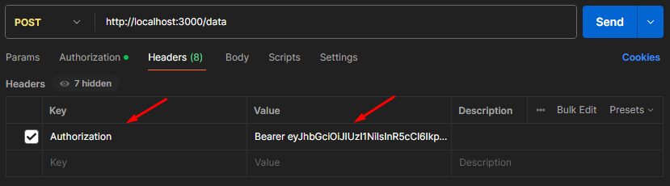

# RESTful API with Authentication and Data Management

This project is a complete **RESTful API** built using **Express.js** and **MongoDB**. It includes user authentication (signup and login) with **JWT (JSON Web Tokens)**, secure password hashing using **bcrypt**, and CRUD operations for managing data. The project also uses **dotenv** for environment variables.

## Features

- User Authentication:
  - Signup with input validation.
  - Secure login with token-based authentication.
  - Passwords hashed using bcrypt.
- CRUD Operations:
  - Create, Read, Update, and Delete (CRUD) operations on data.
  - Data linked to authenticated users.
- JWT Authentication:
  - Protects routes using JWT-based middleware.
  - Ensures secure access to user-specific data.
- Validation:
  - Input validation using **express-validator**.
- Environment Configuration:
  - Environment variables managed using **dotenv**.

## Tech Stack

- **Backend:** Express.js
- **Database:** MongoDB with Mongoose
- **Authentication:** JWT and bcrypt
- **Validation:** express-validator

## Prerequisites

Ensure you have the following installed:

- [Node.js](https://nodejs.org) (v14 or above)
- [MongoDB](https://www.mongodb.com/try/download/community) (running locally or a connection URI)
- [Postman](https://www.postman.com/downloads) (API Testing Tool)

## Installation

1. Clone the repository:
2. Install dependencies:

   ```bash
   npm install
   ```

3. Configure environment variables: Create a `.env` file in the root directory and add the following:

   ```plaintext
    PORT=3000
    MONGO_URI=mongodb://127.0.0.1:27017/auth_demo
    JWT_SECRET=yourSuperSecretKey
    JWT_EXPIRES_IN=1h
    BCRYPT_SALT_ROUNDS=10
   ```

4. Run the server:

   ```bash
   node index.js
   ```

   The server will run at `http://localhost:3000`.

## API Endpoints

### **Authentication**

| Method | Endpoint       | Description      | Protected |
| ------ | -------------- | ---------------- | --------- |
| POST   | `/auth/signup` | User signup      | No        |
| POST   | `/auth/login`  | User login (JWT) | No        |

### **Data Management**

| Method | Endpoint    | Description          | Protected |
| ------ | ----------- | -------------------- | --------- |
| POST   | `/data`     | Create new data      | Yes       |
| GET    | `/data`     | Retrieve all data    | Yes       |
| PUT    | `/data/:id` | Update specific data | Yes       |
| DELETE | `/data/:id` | Delete specific data | Yes       |

## Project Structure

```bash
project/
├── index.js                # Entry point
├── models/
│   ├── userModel.js        # User schema
│   └── dataModel.js        # Data schema
├── routes/
│   ├── authRoutes.js       # Signup and Login routes
│   └── dataRoutes.js       # Data CRUD routes
├── middlewares/
│   └── authMiddleware.js   # JWT verification middleware
├── validation/
│   └── validateUser.js     # User validation rules
├── .env                    # Environment variables
├── package.json            # Dependencies
└── README.md               # Documentation
```

## How to Use

1. **Signup:** Send a POST request to `/auth/signup` with the following JSON body:

   ```json
   {
     "name": "John Doe",
     "email": "john.doe@example.com",
     "password": "securepassword"
   }
   ```

2. **Login:** Send a POST request to `/auth/login` with the following JSON body:

   ```json
   {
     "email": "john.doe@example.com",
     "password": "securepassword"
   }
   ```

   On successful login, you will receive a JWT token.

3. **Access Protected Routes:** Include the JWT token in the `Authorization` header as follows:

   ```plaintext
   Authorization: Bearer <your-token>
   ```

   

4. **CRUD Operations:** Use the `/data` endpoints for creating, reading, updating, and deleting data. Ensure you are logged in and include the JWT token in the `Authorization` header.

CRUD Data Sample: (Insert)

```jsx
{
    "title": "Tailwind CSS",
    "content": "CSS Framework"
}
```

## **📄 License**

This project is licensed under the MIT License - see the [LICENSE](LICENSE) file for details.

## **🤝 Contributing**

Pull requests are welcome. For major changes, please open an issue first to discuss what you would like to change.
